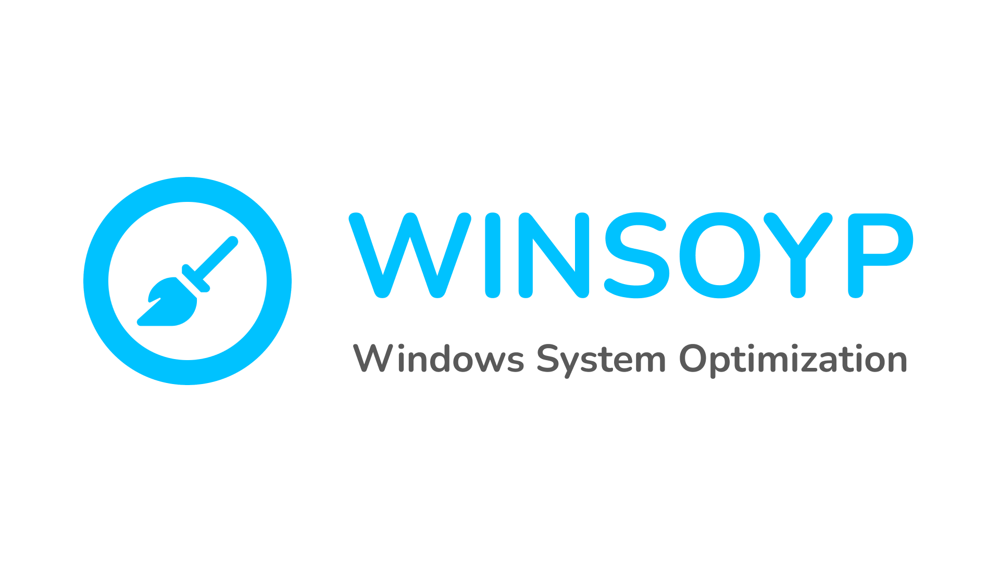

# WINSOYP



### Описание

Программа по очистке системы под управлением Windows11 от временных файлов.

### Запуск проекта

Установите используемые библиотеки проекта

```
pip install -r requirements.txt
```

Запуск проекта

```
python ShortStory.py
```

### Запуск exe

Запускать от имени администратора

### Список используемых библиотек

`tkinter`
`customtkinter`
`webbrowser`
`os`
`shutil`
`subprocess`
